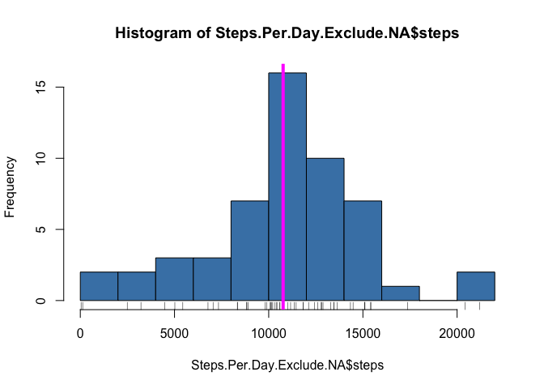
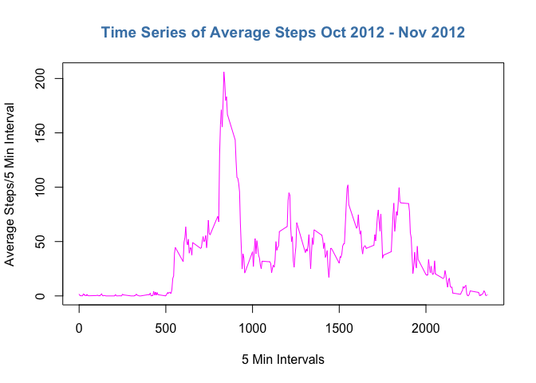
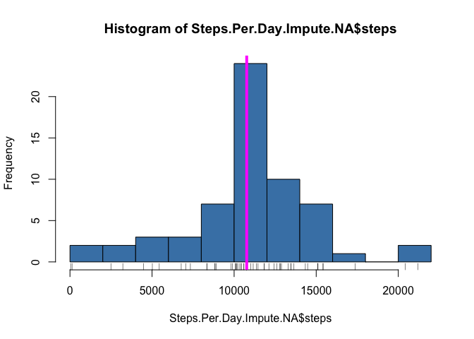
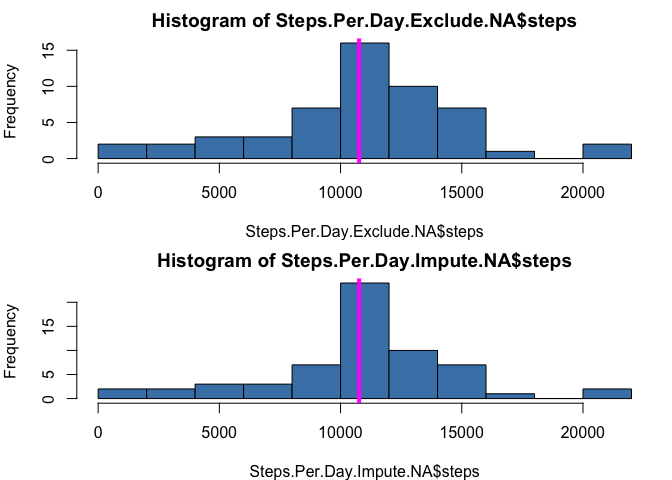
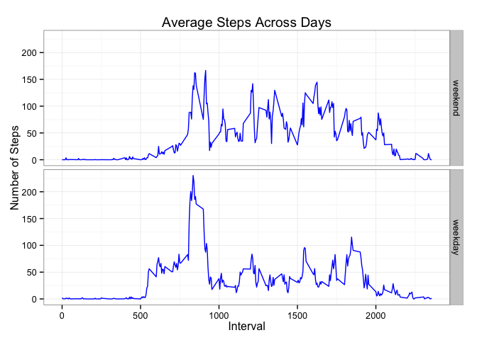
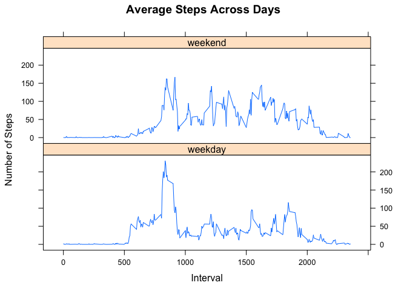

Reproducible Research Assignment 1
===================================
--- 
author: "bclayton"
date: "October 17, 2015"
output:html_document: keep_md: yes
---
 

This report is an analysis of data from a personal activity monitoring device. 
Data was collected at 5 minute intervals through out the day. The data consists 
of two months of data from an anonymous individual collected during the months 
of October and November, 2012 and include the number of steps taken in 5 minute 
intervals each day.is some text.  The report answers the quesitons:

1. what is the mean total number of steps taken per day?
2. what is the average daily activity pattern?
3. Are their differences in activity patterns between weekdays and weekends?

**Set Working Environment**


```r
library(dplyr)
```

```
## 
## Attaching package: 'dplyr'
## 
## The following objects are masked from 'package:stats':
## 
##     filter, lag
## 
## The following objects are masked from 'package:base':
## 
##     intersect, setdiff, setequal, union
```

```r
library(data.table)
```

```
## 
## Attaching package: 'data.table'
## 
## The following objects are masked from 'package:dplyr':
## 
##     between, last
```

```r
library(ggplot2)
library(reshape2)
```

```
## 
## Attaching package: 'reshape2'
## 
## The following objects are masked from 'package:data.table':
## 
##     dcast, melt
```

```r
library(lattice)
```


####Loading and preprocessing data


```r
activityData <- read.csv("activity.csv")
activityData$date <- as.Date(activityData$date)
nnData <- filter(activityData, steps != "NA")
```

####What is the mean total number of steps taken per day?

**Total the data by date**

```r
Steps.Per.Day.Exclude.NA<- data.table(nnData)
Steps.Per.Day.Exclude.NA <- Steps.Per.Day.Exclude.NA[,list(steps=sum(steps)), by='date']
```

**Create Histogram of total steps per day over October and November**


```r
hist(Steps.Per.Day.Exclude.NA$steps, col= "steelblue", breaks = 10)
rug(Steps.Per.Day.Exclude.NA$steps)
abline( v = median(Steps.Per.Day.Exclude.NA$steps), col = "magenta", lwd = 4)
```

 

**Calculate mean and median total number of steps taken per day**


```r
meansteps <- format(mean(Steps.Per.Day.Exclude.NA[[2]]), digits=5)
mediansteps <- format(median(Steps.Per.Day.Exclude.NA[[2]]), digits=5)
```

- The mean of total steps taken daily is  **10766**  
- The median of total steps taken daily is **10765**

####What is the average daily activity pattern?

creating tidy data set of average steps per 5 min interval across all days (ignored NA values) and determine interval with max steps

```r
avgsteps = with(nnData, tapply(X=steps, INDEX=list(interval=interval), FUN=mean))
avgsteps.melt <- melt(avgsteps)
plotavgsteps <- data.frame('interval' = avgsteps.melt[,1],
                   'avg steps' = avgsteps.melt[,2])
maxsteps <- filter(plotavgsteps, avg.steps==(max(plotavgsteps$avg.steps)))                  
```

Creating time series plot of average steps taken over 5 minute intervals

```r
with(plotavgsteps, plot(interval,avg.steps,                                            
                          type = "l", 
                          xlab = "5 Min Intervals",
                          ylab = "Average Steps/5 Min Interval",
                          col = "magenta"))
title("Time Series of Average Steps Oct 2012 - Nov 2012", cex=0.8, col.main = "steelblue")
```

 

####Which 5-minute interval has the max number of steps?
- The 5 minute interval which has the maximum number of steps is **835**  
- The average steps for 
this interval is  **206.17**


####Imputing missing values

The data file has a number of days/intervals where there are missing values (coded as NA). The presence of missing days may introduce bias into some calculations or summaries of the data.

1. Calculate and report the total number of missing values in the dataset (i.e. the total number of rows with NAs)


```r
naData <- filter(activityData, is.na(steps))
```

- The number of rows in the data set with missing values is **2304**

2. Selected strategy to fill missing values is to use the mean for that 5-minute interval.


```r
naData$steps<-plotavgsteps[match(naData$interval, plotavgsteps$interval),2]
```

3. Create a new dataset that is equal to the original dataset but with the missing data filled in.


```r
allData <- rbind(naData, nnData)
allData <- allData[order(allData$date),]
```

4. Make a histogram of the total number of steps taken each day using new dataset

- data set with total number of steps taken

```r
Steps.Per.Day.Impute.NA<- data.table(allData)
Steps.Per.Day.Impute.NA <- Steps.Per.Day.Impute.NA[,list(steps=sum(steps)), by='date']
```

- histogram of new dataset

```r
##All.Steps.Per.Day <- with(allData, tapply(X = steps, INDEX = date, FUN = sum)) 
hist(Steps.Per.Day.Impute.NA$steps, col= "steelblue", breaks = 10)
rug(Steps.Per.Day.Impute.NA$steps)
abline( v = median(Steps.Per.Day.Impute.NA$steps), col = "magenta", lwd = 4)
```

 

- Calculate and report the mean and median total number of steps taken per day. 

```r
meanallsteps <- format(mean(Steps.Per.Day.Impute.NA[[2]]), digits=5)
medianallsteps <- format(median(Steps.Per.Day.Impute.NA[[2]]), digits=5)
```

The values of total steps mean and median when using imputed values for NA values is simliar to when we exclude NA values:

- Mean with imputed NA:    **10766**   

- Mean excluding NA:   **10766**

- Median with imputed NA:  **10766** 

- Median excluding NA: **10765**


####Here are the histagrams of each side by side:


```r
par( mfrow = c( 2, 1), mar = c( 4, 4, 2, 1))
hist(Steps.Per.Day.Exclude.NA$steps, col= "steelblue", breaks = 10)
abline( v = median(Steps.Per.Day.Exclude.NA$steps), col = "magenta", lwd = 4)
hist(Steps.Per.Day.Impute.NA$steps, col= "steelblue", breaks = 10) 
abline( v = median(Steps.Per.Day.Impute.NA$steps), col = "magenta", lwd = 4)
```

 

####Are there differences in activity patterns between weekdays and weekends?

Using the 'allData' dataset which has imputed values for rows where steps is 'NA', created a new 'day' variable with weekdays() function on the 'date' field. 
Created a new factor variable, 'weekpart' with two levels -  “weekday” and “weekend” indicating whether a 'day' is a weekday or weekend day.


```r
patternData <- transform(allData, day = weekdays(date))
weekdays <- c('Monday', 'Tuesday', 'Wednesday', 'Thursday', 'Friday')
patternData$weekpart <- factor(patternData$day %in% weekdays, 
                          levels=c(FALSE, TRUE), labels = c("weekend", "weekday"))
```

Creating tidy dataset to show a panel plot containing a time series plot of the 5-minute interval (x-axis) and the average number of steps taken, averaged across all weekday days or weekend days (y-axis). 

```r
patternAvgSteps <- with(patternData, tapply(X=steps, 
                INDEX=list(weekpart=weekpart,interval=interval), 
                FUN=mean))
patternAvgSteps.melt <- melt(patternAvgSteps) 
names(patternAvgSteps.melt)[3] <- c("avgSteps")
```

**Creating a panel plot using ggplot**


```r
g <- ggplot(patternAvgSteps.melt, aes(interval, avgSteps))
g + geom_line(color = "blue") + facet_grid(weekpart~.) + labs (title = "Average Steps Across Days") + labs (x = "Interval", y = "Number of Steps") + theme_bw()
```

 


**Creating a panel plot using lattice**

```r
##levels(patternAvgSteps.melt$weekpart) <- c("weekday", "weekend") 
xyplot(avgSteps ~ interval|weekpart, data = patternAvgSteps.melt, type = "l", layout=c(1,2), as.table=TRUE, xlab = "Interval", ylab = "Number of Steps", main="Average Steps Across Days")
```

 


####Including session info for reproducibility

```r
sessionInfo()
```

```
## R version 3.2.1 (2015-06-18)
## Platform: x86_64-apple-darwin13.4.0 (64-bit)
## Running under: OS X 10.10.3 (Yosemite)
## 
## locale:
## [1] en_US.UTF-8/en_US.UTF-8/en_US.UTF-8/C/en_US.UTF-8/en_US.UTF-8
## 
## attached base packages:
## [1] stats     graphics  grDevices utils     datasets  methods   base     
## 
## other attached packages:
## [1] lattice_0.20-33  reshape2_1.4.1   ggplot2_1.0.1    data.table_1.9.6
## [5] dplyr_0.4.3     
## 
## loaded via a namespace (and not attached):
##  [1] Rcpp_0.12.1      knitr_1.11       magrittr_1.5     MASS_7.3-44     
##  [5] munsell_0.4.2    colorspace_1.2-6 R6_2.1.1         stringr_1.0.0   
##  [9] plyr_1.8.3       tools_3.2.1      parallel_3.2.1   grid_3.2.1      
## [13] gtable_0.1.2     DBI_0.3.1        htmltools_0.2.6  lazyeval_0.1.10 
## [17] yaml_2.1.13      assertthat_0.1   digest_0.6.8     formatR_1.2.1   
## [21] evaluate_0.8     rmarkdown_0.8    labeling_0.3     stringi_0.5-5   
## [25] scales_0.3.0     chron_2.3-47     proto_0.3-10
```

